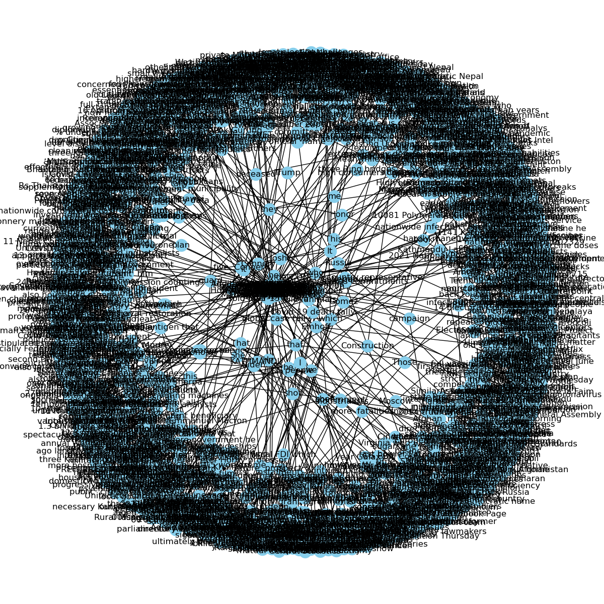
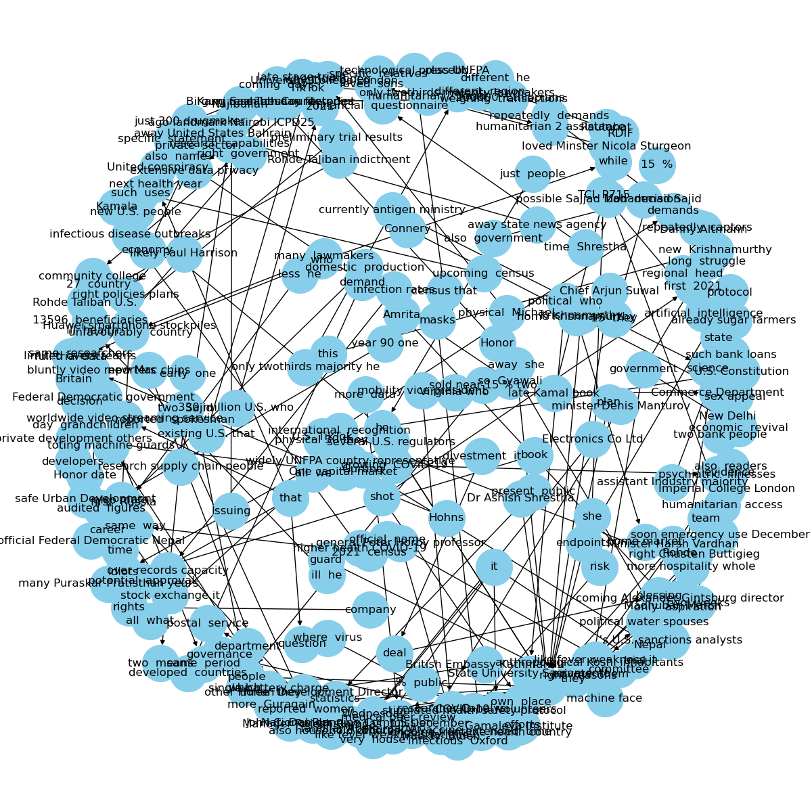

# Knowledge Graph

This project deals with scraping articles from [The Himalayan Times](https://thehimalayantimes.com/) and building a Knowledge Graph using the subject, object and realtionship entities extracted from them.

***

### Knowledge Graph Output

* Directed Graph generated from complete extracted entities

* Directed Graph for the single relation "said"

***

### Tools Used

* BeautifulSoup
* spaCy
* pandas
* NetworkX
* Matplotlib